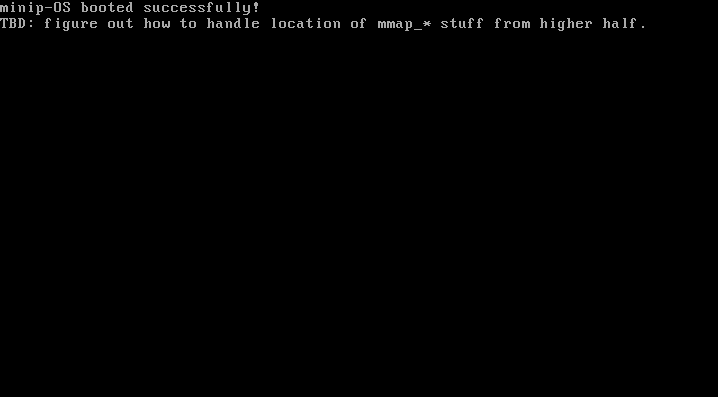
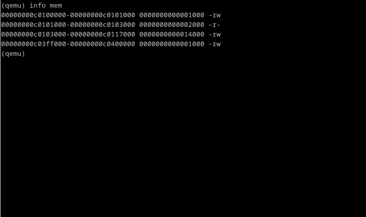

# MiniP-OS

## Introduction:
This project has been abandoned due to continuing research I did during the creation process. I learned firstly that a modern OS should really be UEFI-primary, and secondly that Pascal was an order of magnitude more difficult to create a working toolchain for than C. Thus, I have begun work on another project from scratch, which is up to the GDT stage.

MiniP-OS is a pet project to learn basic OSDev I have started several times, to varying degrees of success. This repo contains my most recent attempt, started as of November 2022. This is unlikely to go anywhere, as it is a personal research project. Any recommendations or suggestions are welcome, however, as I am very much new to operating system architecture!

## Current State:

## Implemented Features:
- [X] Boots
- [ ] GDT
- [ ] Memory Map
- [ ] Interrupts
- [ ] Memory Manager
- [ ] Keyboard
- [ ] Console
- [ ] System Calls

## How to Compile:
- Build GCC crosscompiler + binutils for i686
- Download 32-bit copy of the FreePascal compiler
- Make sure your computer has up to date `grub-mkrescue`
- Compile with `make`
- Run in suitable machine emulator; has been tested in qemu

Note that this probably can't be built on Windows, due to steps one and three.
